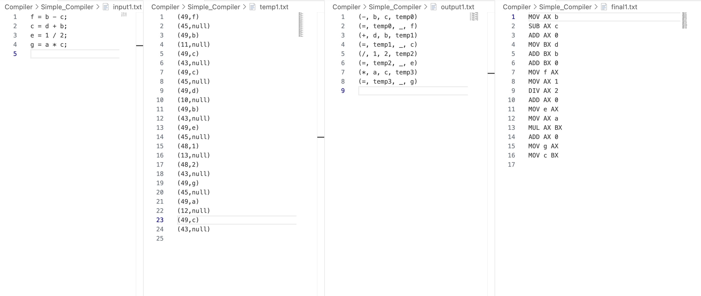

# Simple-Compiler-Implement

In this repository, I successfully implement a simple c++ compiler based on c++.

## preview



## usage

choose a file to join in.

```
cd Simple_Compiler
```

compile the cpp file.

```
g++ main.cpp -o main
```

run the code.

```
./main.out
```

then you can check the result from the `final.txt`.


